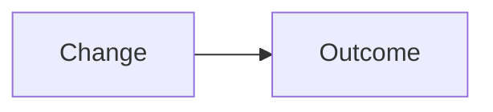

Closes #

## Human Review Briefing

<!-- Reviewer-owned, evidence-backed, maximum 700 words. Publisher replaces it verbatim at readiness. -->

### 60-Second Summary

-

### Flow

### Review Guide

- Change map:
- Suggested review order:
- Proof:

### Risks And Approval

- Architecture impact:
- Risk map:
- Approve when:
- Open questions:
- Non-goals:
- Residual risks:

## Current State

- Stage: red | green | ready
- Review:
- CI:
- Blockers:

## Scope

- Changed paths:

## Verification

- Focused test:
- `cargo fmt --check`:
- `cargo clippy --all-targets --all-features -- -D warnings`:
- `cargo test --all`:

## Architecture And Docs

- Architecture evidence:
- Documentation or ADR impact:

## Commits

- Red:
- Green:
- Head:

## Audit Trail

- Issue:
- Red evidence:
- Green/rework evidence:
- Readiness evidence:
