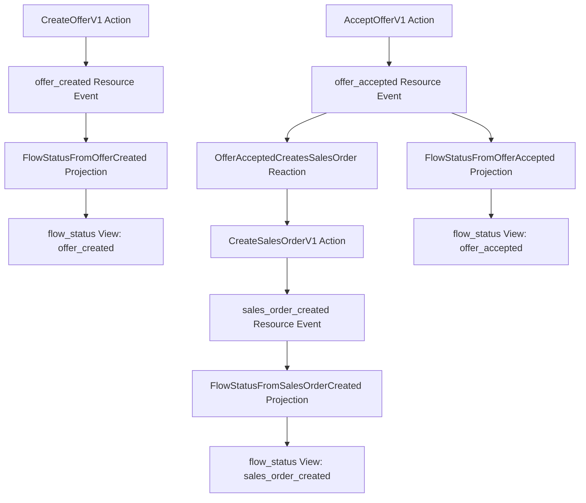

# Phase 6 Reactions And Views Checkpoint

This checkpoint covers Phase 5 Reactions and Phase 6 Views before NATS adapter work starts.

The checkpoint is a review artifact, not a new runtime source of truth. It summarizes what the current in-memory framework proves, what a human can demonstrate today, and which decisions must be made before Phase 7.

## Checkpoint Answers

| Question | Answer |
| --- | --- |
| Can a human understand the runtime or architecture flow? | Yes. The current reference flow is visible as `Action -> Resource Event -> Reaction -> Action -> Resource Event -> Projection -> View`. |
| Can behavior be demonstrated without reading source code? | Yes for the in-memory reference flow. `cargo test -p elbmesh-core --test reference_flow reference_flow_projects_document_flow_status_view` proves the Flow Status View path, and this document explains the expected flow. |
| Do tests cover key success, rejection, failure, and recovery paths? | Success, rejection, named runtime failures, Reaction dispatch failures, projection deserialization failures, and ViewStore index behavior are covered. Durable recovery and adapter delivery semantics remain deferred to Phases 7 and 8. |
| Are Resource Events still separate from journals and Views? | Yes. ActionJournal and ReactionJournal records are separate stores. View writes go through `ViewStore` and do not append Resource Events. |
| What debt or ambiguity should be resolved before Phase 7? | EventStore adapter contracts, NATS key/subject rules, ViewStore index persistence semantics, projection checkpoint policy, and journal retry/idempotency decisions must be explicit before distributed adapters. |

## Current Architecture Flow



Runtime lanes remain separate:

```text
Resource Event streams:
  offer/offer-1: offer_created, offer_accepted
  sales_order/sales-order-for-offer-1: sales_order_created

ActionJournal streams:
  action_id -> ActionCalled / ActionCompleted / ActionRejected / ActionFailed

ReactionJournal streams:
  reaction_id -> ReactionTriggered / ReactionCompleted

ViewStore documents:
  flow_status/offer-1 with all and by_status indexes
```

## Demonstration Run

Run the focused human-inspectable reference flow:

```bash
cargo test -p elbmesh-core --test reference_flow reference_flow_projects_document_flow_status_view
```

Expected result:

```text
1 test passes.
The test creates and accepts an Offer through ActionExecutor.
The existing Reaction dispatch creates a Sales Order through ActionExecutor.
The ProjectionDispatcher projects offer_created, offer_accepted, and sales_order_created.
The final flow_status View is loadable by ViewKey("flow_status", "offer-1").
The same View is listable through the explicit all index.
All EventStore records remain StreamType::Resource.
```

Run the full Phase 5 and Phase 6 proof set:

```bash
cargo test -p elbmesh-core --test reaction_journal
cargo test -p elbmesh-core --test reaction_runtime
cargo test -p elbmesh-core --test view_store
cargo test -p elbmesh-core --test projection_runtime
cargo test -p elbmesh-core --test reference_flow
```

## Test Coverage Matrix

| Capability | Proof Test | Coverage |
| --- | --- | --- |
| ReactionJournal contract | `reaction_journal.rs` tests | Appends, loads, stream validation, and Resource Event separation. |
| One Event triggers one Action | `offer_accepted_reaction_executes_create_sales_order_through_action_executor` | Reaction deserializes Resource Event and executes typed Action through `ActionExecutor`. |
| Reaction records lifecycle | `matching_reaction_records_triggered_and_completed_journal_records` | `ReactionTriggered` and `ReactionCompleted` are written separately from Resource Events. |
| Non-matching Reaction source ignored | `non_matching_event_is_ignored_without_resource_events_or_reaction_journal_records` | No Action, no Resource Event, no ReactionJournal records. |
| Non-Resource Reaction source ignored | `matching_event_type_from_non_resource_stream_is_ignored` | Journal streams do not feed Resource Event Reactions. |
| Multiple Reaction handlers | `one_event_dispatches_to_multiple_matching_reaction_handlers` | One Resource Event can dispatch to multiple typed Reaction handlers. |
| Reaction dispatch failure shape | `multiple_reaction_dispatch_continues_after_one_handler_fails` | Dispatch continues and returns structured named failures. |
| Deterministic Reaction Action IDs | `default_reaction_execution_uses_deterministic_action_id`, `same_reaction_retry_uses_same_deterministic_action_id`, `deterministic_reaction_action_id_uses_structured_identity_not_delimiters` | Same Reaction/source Event derives same Action ID; different identities do not collide by delimiter ambiguity. |
| Reference-flow Reaction | `dispatching_offer_accepted_creates_sales_order_through_reference_flow_reaction` | `offer_accepted` drives `CreateSalesOrderV1` and appends `sales_order_created`. |
| ViewStore contract | `view_store.rs` tests | Store/load, missing loads, overwrite, isolation, and Resource Event separation. |
| View indexes | `in_memory_view_store_lists_all_index_with_empty_prefix`, `in_memory_view_store_lists_matching_index_prefix_only`, `in_memory_view_store_overwrite_replaces_index_membership` | Explicit `all` and prefixed indexes are deterministic and current-document based. |
| ProjectionRuntime single source | `matching_resource_event_projects_view_document` | One typed Resource Event projects a View document. |
| Projection matching guards | `non_matching_event_is_ignored_without_view_writes`, `matching_event_type_from_non_resource_stream_is_ignored_without_view_writes`, `schema_or_resource_mismatch_is_ignored_without_view_writes` | Event type, schema id/version, Resource type, and stream type all gate projection. |
| Projection failure shape | `matching_event_with_invalid_payload_returns_named_deserialization_error` | Invalid matching payload returns named deserialization error. |
| Multi-Resource projections | `dispatcher_applies_projections_from_multiple_resource_types_to_same_view` | Offer and Sales Order Resource Events can update the same View identity through separate typed projections. |
| Projection dispatch failure shape | `dispatcher_returns_named_failures_with_details` | Dispatch returns structured named failure details. |
| Reference-flow Flow Status View | `reference_flow_projects_document_flow_status_view` | End-to-end Action, Reaction, Projection, View load, and View index listing proof. |
| Reference-flow manifest View | `reference_flow_manifest_json_names_resources_actions_and_events`, `reference_flow_manifest_validates_successfully`, `reference_flow_architecture_check_report_passes` | Manifest declares `flow_status` and still passes architecture checks. |

## Failure Mode Matrix

| Scenario | Current Behavior | Visible Records | Risk | Detection Today | Future Requirement |
| --- | --- | --- | --- | --- | --- |
| Reaction trigger deserialization fails | Runtime returns `ReactionExecutionError::TriggerEventDeserialization`; dispatcher wraps structured failure details. | No Resource Event append from the failed Reaction; ReactionJournal may not have lifecycle records. | Bad source payload can block one handler. | Reaction dispatch failure tests cover structured errors and continuation. | Adapter overlays must preserve failure details without emitting domain Events. |
| Reaction handler Action fails | `ActionExecutor` returns typed `ExecutionError`; dispatcher records named failure details. | ActionJournal may show called/rejected/failed depending on failure path; Resource Events remain clean on failure. | Retry policy is still local and not durable. | Reaction dispatcher failure tests. | Phase 8 Restate retry policy must use deterministic Action IDs and journal state. |
| Duplicate Reaction delivery | Default Reaction Action ID is deterministic for Reaction/source Event. | Same Action ID is reused. | `ActionExecutor` still does not journal-replay/short-circuit duplicate Actions. | Deterministic ID tests prove identity only. | Decide ActionJournal idempotency before Restate and before at-least-once NATS delivery. |
| Projection source mismatch | `ProjectionRuntime::apply` returns `Ok(false)`. | No View write. | Silent ignores are correct locally but need observability in subscription loops. | Projection mismatch tests. | Phase 7/10 tooling should expose ignored counts if running dispatch loops. |
| Projection source deserialization fails | Runtime returns `ProjectionExecutionError::SourceEventDeserialization`; dispatcher wraps named failure details. | No View write for that handler. | View may lag behind Resource Events until replay succeeds. | Projection failure tests. | Projection checkpoint policy must not advance past failed required projections. |
| View write fails | Runtime returns `ProjectionExecutionError::ViewStore`. | Resource Events remain unchanged; View not updated. | Rebuild or retry policy is undefined. | ViewStore named error exists; poison path not directly tested. | NATS KV adapter must expose named write/serialization/conflict failures. |
| View index declaration missing | `list_by_index_prefix` returns empty list. | View may still be loadable by identity. | Query can miss unindexed documents. | Missing-index test. | Generated manifests/docs should declare required indexes before Phase 9. |
| View overwrite changes index membership | Current in-memory listing scans current documents, so old index membership disappears. | Latest View document only. | Durable adapters must maintain the same current-index semantics. | Overwrite index test. | NATS KV/ViewStore contract tests must prove stale index entries are removed or ignored. |

## Technical Debt And Ambiguities

| ID | Severity | Debt | Evidence | Consequence | Next Handling |
| --- | --- | --- | --- | --- | --- |
| RV1 | High | EventStore adapter contract is still underspecified for gaps, duplicates, wrong-stream records, and wrong schema metadata. | Existing in-memory EventStore sorts replay; NATS adapter work begins in Phase 7. | Adapter corruption can affect Actions, Reactions, and Projections. | Phase 7.2/7.3 must define reusable EventStore contract tests before adapter behavior expands. |
| RV2 | High | ActionExecutor has deterministic downstream Action IDs from Reactions, but no ActionJournal replay/idempotency gate. | `ReactionRuntime::reaction_action_id` is stable; executor still runs same `action_id` again. | At-least-once delivery can still re-execute handlers. | Phase 8 retry proof must decide journal replay semantics; Phase 7 must avoid implying exactly-once. |
| RV3 | High | Projection checkpoint semantics do not exist. | `ProjectionDispatcher` returns applied counts/failures but stores no checkpoint. | A subscription loop cannot safely resume after partial projection failure. | Defer implementation, but Phase 7 View/NATS work must not add implicit checkpoint behavior. |
| RV4 | Medium | View indexes are declared on documents, not validated against manifest View definitions. | `ViewDefinition` has no index declarations yet. | Generated docs and adapters can drift from query assumptions. | Phase 9 should generate index docs/contracts; earlier if Phase 7 KV adapter needs it. |
| RV5 | Medium | InMemoryViewStore scans documents for index queries. | MR 6.4 intentionally avoided separate mutable index state. | Behavior is correct locally but does not model KV/object-store cost. | Phase 7 NATS KV ViewStore must choose durable index representation and pass same behavior tests. |
| RV6 | Medium | Projection dispatch failures are returned to caller but not journaled. | There is no ProjectionJournal or checkpoint record. | Operators need caller/tooling to observe failures. | Keep out of Resource Events; revisit with checkpoint/subscription design. |
| RV7 | Low | Reference-flow projections overwrite Flow Status payload instead of preserving full history. | Final View contains latest status, not a timeline. | Human demo is a status view, not an audit view. | Accept for Phase 6; historical truth remains Resource Events and journals. |
| RV8 | Low | Duplicate index entries for one document are unspecified. | `InMemoryViewStore` returns a document once using the first matching declared index entry for ordering. | Ambiguous generated index output could produce surprising order. | Specify or reject duplicate entries when generated views are introduced. |

## Phase 7 Decision List

These decisions should be resolved or explicitly deferred before NATS adapter implementation changes behavior:

1. Define EventStore load contract for ordering, gaps, duplicate sequences, wrong stream, wrong Resource metadata, and wrong schema metadata.
2. Define NATS subject/key escaping for Resource streams, ActionJournal streams, ReactionJournal streams, and ViewStore keys.
3. Decide whether NATS-backed ActionJournal writes are required or best-effort for each lifecycle record.
4. Keep ReactionJournal and ActionJournal records out of Resource Event streams in every adapter contract.
5. Define NATS KV ViewStore index representation so overwrite removes stale index membership or makes stale entries unobservable.
6. Do not add projection checkpoint semantics accidentally while implementing ViewStore or subscription adapters.
7. Document that deterministic Reaction Action IDs are identity inputs, not full retry idempotency until ActionJournal replay semantics exist.
8. Decide which adapter failure details are stable public diagnostics versus infrastructure overlays.

## Human Review Run

Before approving Phase 7 work, a reviewer should run:

```bash
cargo fmt --check
cargo clippy --all-targets --all-features -- -D warnings
cargo test --all
cargo test -p elbmesh-core --test reference_flow reference_flow_projects_document_flow_status_view
```

Then inspect these artifacts:

```text
docs/PHASE_6_REACTIONS_VIEWS_CHECKPOINT.md
docs/RUNTIME_DEBT_AND_FAILURE_MODES.md
docs/EXECUTION_TRACE_MODEL.md
docs/OFFER_DEMONSTRATION_RUN_PLAN.md
```

The older Phase 2.5 and Phase 4 documents remain historical checkpoints. This Phase 6 document is sufficient for the new Reactions and Views review because it records the current debt, flow diagram, coverage matrix, demo run, and Phase 7 decisions in one place. The older documents should not be rewritten as if they were current-state documents.

## Gate Results

The required gates were run again after adding this checkpoint document:

```text
cargo fmt --check: passed
cargo clippy --all-targets --all-features -- -D warnings: passed
cargo test --all: passed
```
