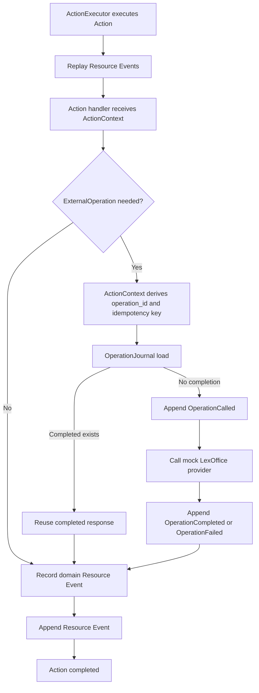

# Phase 8 NATS And External Operations Checkpoint

This checkpoint covers Phase 7 NATS adapters and Phase 8 External Operations before Phase 9 generation and capability docs start.

The checkpoint is a review artifact, not a new runtime source of truth. It summarizes what the current framework proves, what a human can demonstrate today, and which decisions remain before adding generated docs and bindings.

## Checkpoint Answers

| Question | Answer |
| --- | --- |
| Can a human understand the runtime or architecture flow? | Yes. The current flow is visible as `Action -> optional ExternalOperation -> Resource Event`, with ActionJournal, OperationJournal, ReactionJournal, ViewStore, and NATS adapter stores staying separate. |
| Can behavior be demonstrated without reading source code? | Yes. Focused tests prove NATS feature gating, NATS-backed ActionJournal/ViewStore contracts, ExternalOperation idempotency, ActionContext execution, and retry after append failure. |
| Do tests cover key success, rejection, failure, and recovery paths? | Success, domain rejection, runtime failure, NATS contract behavior, ExternalOperation provider failure, OperationJournal wrong-stream errors, and append-failure retry reuse are covered. A real Restate adapter remains deferred. |
| Are Resource Events still separate from journals, Views, and provider details? | Yes. Resource Event streams only contain domain Events. ActionJournal, ReactionJournal, OperationJournal, ViewStore documents, and NATS KV records are separate. |
| What debt or ambiguity should be resolved before Phase 9? | Generation must describe declared capabilities without implying generated runtime coverage for Restate or unimplemented NATS EventStore/ReactionJournal/OperationJournal adapters. |

## Current Architecture Flow



Runtime lanes remain separate:

```text
Resource Event streams:
  resource_type/resource_id -> domain Events only

ActionJournal streams:
  action_id -> ActionCalled / ActionCompleted / ActionRejected / ActionFailed

OperationJournal streams:
  operation_id -> OperationCalled / OperationCompleted / OperationFailed

ReactionJournal streams:
  reaction_id -> ReactionTriggered / ReactionCompleted

ViewStore documents:
  view_type/view_id -> latest ViewDocument and derived indexes

NATS adapter stores:
  ActionJournal KV bucket and ViewStore KV bucket are feature-gated and separate
```

## Demonstration Runs

Run the default suite without NATS:

```bash
cargo test --all
```

Expected result:

```text
All default tests pass without ELBMESH_NATS_URL.
NATS harness tests are disabled unless nats-tests is enabled.
Resource Events stay separate from journals and ViewStore documents.
```

Run the focused external operation retry proof:

```bash
cargo test -p elbmesh-core --test action_context_external_operation retry_after_append_failure_reuses_completed_external_operation
```

Expected result:

```text
The first attempt calls the mock LexOffice operation and writes OperationCompleted.
The Resource Event append fails once.
The retry reuses OperationCompleted and does not call the provider again.
Exactly one Resource Event is appended after retry.
```

Run NATS-gated tests when a local NATS server is available:

```bash
ELBMESH_NATS_URL=nats://127.0.0.1:4222 cargo test -p elbmesh-core --features nats-tests --test action_journal
ELBMESH_NATS_URL=nats://127.0.0.1:4222 cargo test -p elbmesh-core --features nats-tests --test view_store
```

Expected result:

```text
NATS ActionJournal and NATS ViewStore pass the same contract helpers as in-memory implementations.
If ELBMESH_NATS_URL is missing, NATS-gated tests skip without failing.
```

## Coverage Matrix

| Area | Proof | Notes |
| --- | --- | --- |
| NATS feature gating | `cargo test --all`, `nats_harness` | Default suite does not require NATS. |
| NATS ActionJournal | `cargo test -p elbmesh-core --features nats-tests --test action_journal` | KV key encoding is length-prefixed and percent-encoded. |
| NATS ViewStore | `cargo test -p elbmesh-core --features nats-tests --test view_store` | View docs live in KV; index queries derive from current docs. |
| OperationJournal contract | `cargo test -p elbmesh-core --test operation_journal` | Records are keyed by `operation_id` and separated from Resource Events. |
| ExternalOperation metadata/idempotency | `cargo test -p elbmesh-core --test external_operation` | Mock LexOffice operation exposes typed request/result, operation schema metadata, idempotency, conflicts, and provider failures. |
| ActionContext external operations | `cargo test -p elbmesh-core --test action_context_external_operation` | Context derives operation metadata, maps provider failures, and records Resource Events from selected result facts. |
| Append-failure retry | `retry_after_append_failure_reuses_completed_external_operation` | Completed OperationJournal response prevents a second provider call. |
| Architecture manifest external operations | `cargo test -p elbmesh-core --test architecture_manifest` | Actions must reference declared ExternalOperation definitions without duplicates. |

## Current Decisions

| Decision | Current Position |
| --- | --- |
| Default NATS behavior | Default tests and builds do not require NATS. NATS adapter tests are behind `nats-tests`. |
| NATS harness | `ELBMESH_NATS_URL` controls integration execution; missing env means skip. |
| External operation identity | `ActionContext` derives `operation_id` from action id, operation type, and idempotency key using length-prefixed tokens. |
| Provider retry | Completed OperationJournal records are reused before calling a provider again. |
| Provider details | Provider request/response diagnostics belong in OperationJournal or future object storage, not Resource Events. |
| Restate | Restate remains hidden behind future execution APIs; no real Restate adapter exists yet. |

## Residual Debt

| ID | Severity | Debt | Risk | Next Phase Impact |
| --- | --- | --- | --- | --- |
| P8-D1 | High | No NATS-backed EventStore implementation yet. | Generated capability docs must not imply durable Resource Event NATS support is complete. | Phase 9 docs should describe implemented adapters precisely. |
| P8-D2 | High | No NATS-backed OperationJournal or ReactionJournal adapters yet. | External operation retry proof is in-memory only. | Capability output should distinguish logical contract from adapter availability. |
| P8-D3 | Medium | No real Restate adapter. | The append-failure retry proof models Restate semantics but does not exercise Restate runtime. | Phase 9 should avoid claiming Restate operational support. |
| P8-D4 | Medium | ExternalOperation provider registry and generated binding shape are not defined. | Action handlers still pass concrete operation instances manually. | Phase 9 generated stubs must make this explicit or defer binding generation. |
| P8-D5 | Medium | OperationJournal completed response deserialization failure maps through `ActionError::Serialization`. | Recovery failures are named but not yet specialized by operation response schema. | A later runtime-hardening MR can split this into a dedicated named variant if needed. |

## Phase 9 Entry Criteria

Phase 9 may start if generation work observes these constraints:

```text
Generated docs must describe what is declared and implemented today.
Generated docs must not imply real Restate adapter support.
Generated docs must not imply all NATS adapters exist.
Generated Resource/Event capability docs must keep journals and ViewStore separate from Resource Events.
Generated ExternalOperation docs must include idempotency and OperationJournal boundaries.
```

## Verification

Last required local gates for Phase 8 implementation MRs passed before merge:

```bash
cargo fmt --check
cargo clippy --all-targets --all-features -- -D warnings
cargo test --all
```
